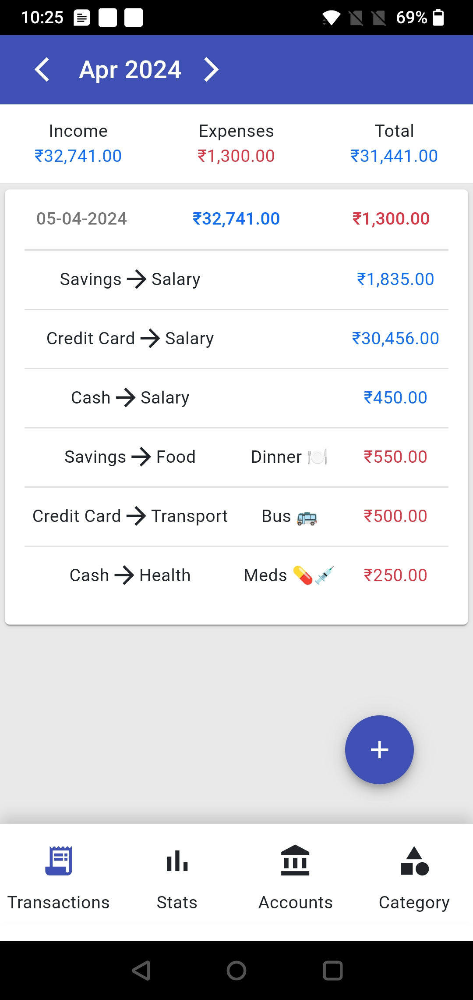
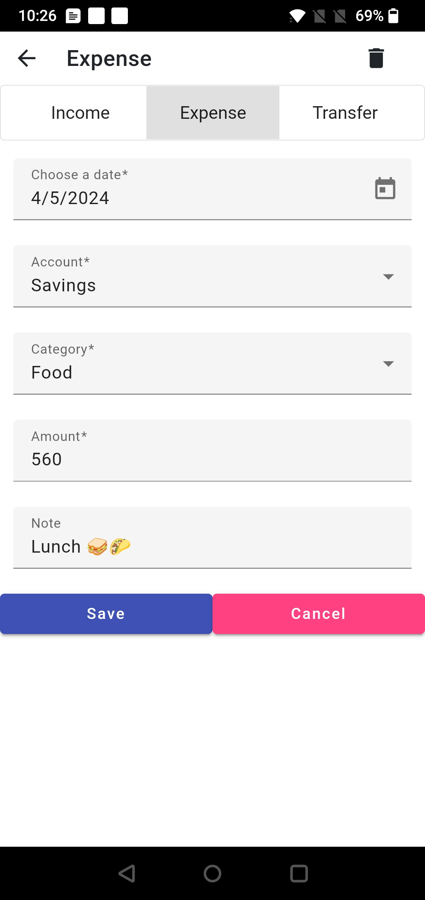
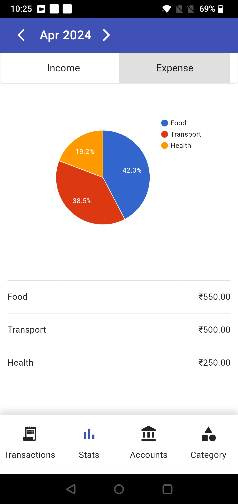
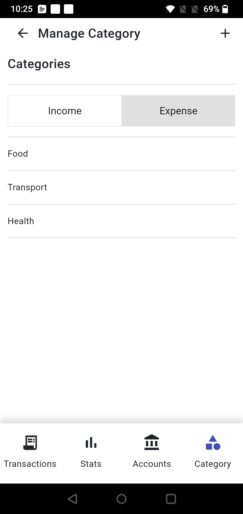

Now Manage your expenses in this **Free to Use** and **No-Ads** Android app
built with **Angular** and **Capacitor JS**, using your devices' local **SQLite database**, So no worries for data sharing/tracking or usage for insights.

It would be greate if you find this app useful and willing to contribute by adding new features.

Sample Screenshots of the Application

