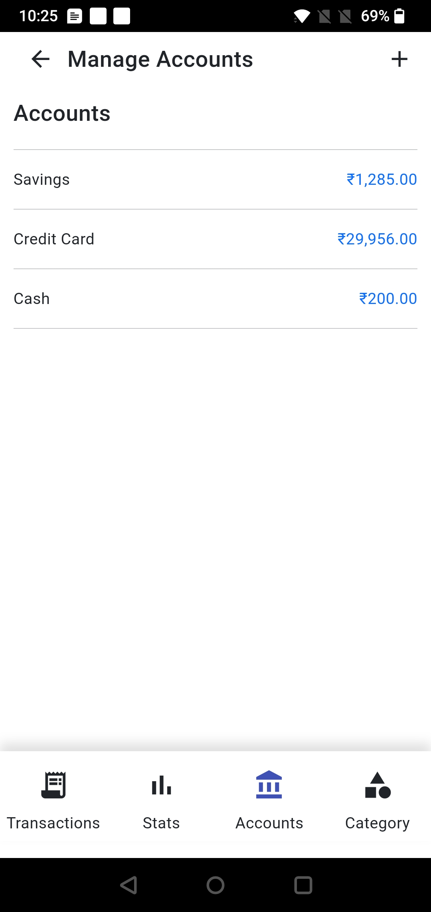

Now Manage your expenses in this **Free to Use** and **No-Ads** Android app
built with **Angular** and **Capacitor JS**, using your devices' local **SQLite database**, So no worries for data sharing/tracking or usage for insights.

It would be greate if you find this app useful and willing to contribute by adding new features.

Sample Screenshots of the Application

| Transactions View | Add New Transaction | Statistics | Accounts | Categories |
| ---- | ---- | ---- | ---- | ---- |
|  |  |  |  | 
 |